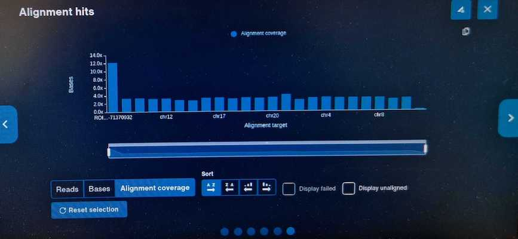

# NGI-AS-tech_note-2024

## Introduction

This repository contains supplementary files for NGI tech note "Tech Note - Adaptive Sampling: targeted  Oxford Nanopore long-read sequencing" published in 2024.

## BED files

There are two sets of BED files with targets. One in hg38 co-ordinate space (in `bedfiles_hg38/`) and another one that requires a custom reference genome (found in `bedfiles_customref`). 

In brief, the way to recreate the custom reference files is to use BEDTools getfasta on hg38 to extract the ROIs to `ROI.fasta` (rename the fasta entries to "ROI"), then use bedtools maskfasta to mask the ROI positions to `hg38_masked.fasta` Then `cat ROI.fasta hg38_masked.fasta > custom_hg38.fasta`
The reason for using this custom reference method is to make it easier to validate in real-time on the instrument that enrichment is occuring:



| experiment_sample | hg38_bed | custom_bed |
| ---- | ---- | ---- |
| P29602_01pct | [day1_0.1pct_targets.bed](bedfiles_hg38/day1_0.1pct_targets.bed) | [day1_0.1pct.bed](bedfiles_customref/day1_0.1pct.bed) |
| P29602_025pct | [day1_0.25pct_targets.bed](bedfiles_hg38/day1_0.25pct_targets.bed) | [day1_0.25pct.bed](bedfiles_customref/day1_0.25pct.bed) |
| P29602_05pct | [day1_0.5pct_targets.bed](bedfiles_hg38/day1_0.5pct_targets.bed) | [day1_0.5pct.bed](bedfiles_customref/day1_0.5pct.bed) |
| P29602_1pct | [day1_1pct_targets.bed](bedfiles_hg38/day1_1pct_targets.bed) | [day1_1pct.bed](bedfiles_customref/day1_1pct.bed) |
| P29602_4pct | [day1_4pct_targets.bed](bedfiles_hg38/day1_4pct_targets.bed) | [day1_4pct.bed](bedfiles_customref/day1_4pct.bed) |
| P29602_8pct | [day1_8pct_targets.bed](bedfiles_hg38/day1_8pct_targets.bed) | [day1_8pct.bed](bedfiles_customref/day1_8pct.bed) |
| P29602_ROI_as_ref | [day1_ROI_as_ref_1pct_targets.bed](bedfiles_hg38/day1_ROI_as_ref_1pct_targets.bed) | [day1_ROI_as_ref_1pct.bed](bedfiles_customref/day1_ROI_as_ref_1pct.bed) |
| P29602_01pct_10ROIs | [1.bed](bedfiles_hg38/1.bed) | - |
| P29602_01pct_80ROIs | [2.bed](bedfiles_hg38/2.bed) | - |
| P29602_day3_gapfill | [day3_nomod_targets.bed](bedfiles_hg38/day3_nomod_targets.bed) | [day3_gapfill.bed](bedfiles_customref/day3_gapfill.bed) |
| Reserved channel experiment | [day1_8pct_targets.bed](bedfiles_hg38/day1_8pct_targets.bed) | [day1_8pct.bed](bedfiles_customref/day1_8pct.bed) |

## Command-line scripts

This is a collection of bespoke one-liners for processing the data in the tech note

### Split channels in the reserved channel experiment
```
# bioawk: https://github.com/lh3/bioawk
# Channels 1-1499 with adaptive sampling
bioawk -cfastx 'match($comment, /ch=[[:digit:]]+ /){if(substr($comment, RSTART+3, RLENGTH-3) < 1500){print "@"$name" "$comment"\n"$seq"\n+\n"$qual}}' passed.fastq.gz | gzip -c > AS.fastq.gz
# Channels 1500-3000 without AS
bioawk -cfastx 'match($comment, /ch=[[:digit:]]+ /){if(substr($comment, RSTART+3, RLENGTH-3) >= 1500){print "@"$name" "$comment"\n"$seq"\n+\n"$qual}}' passed.fastq.gz | gzip -c > noAS.fastq.gz
```

### Count active channels per time interval (fig 5)

```
# Method: Bin reads (passed + failed) into start_time hour. Find and count every 
# unique channel per bin. For future reference: just use nanoplot for this.

bioawk -cfastx '{print $comment}' AS_failed_and_passed.fastq.gz | grep -o "ch=\w* start_time=2023-\w\w-.*+02:00" | cut -b 4- | sed 's/ start_time=/ \t/' | grep -o ".*2023-09-[0-9]*T[0-9]*" | awk '{print $2":00:00\t"$1}' | sort | uniq | cut -f 1 | uniq -c | awk '{print $2"\t"$1}' > AS_chpr.txt
```


